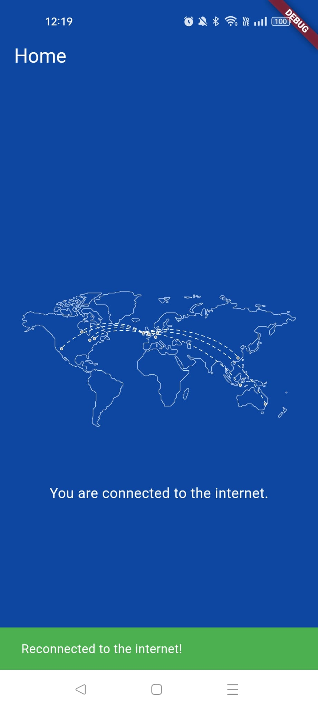
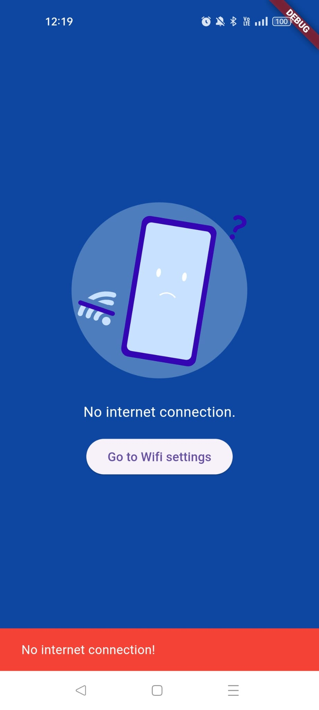

# connection_check_with_rxdart

Here you can find about internect check and rxDart Flutter examples.

## Development Setup
Clone the repository and run the following commands:
```
flutter pub get
flutter run
```

## Screenshots

### Wallet


